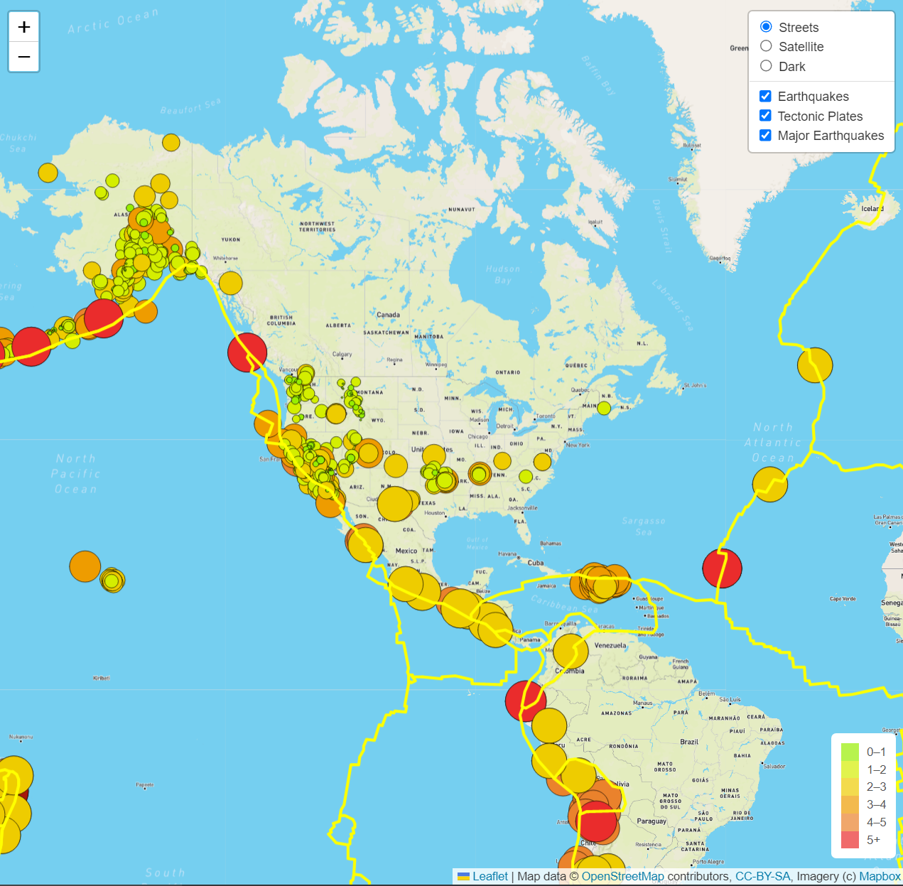
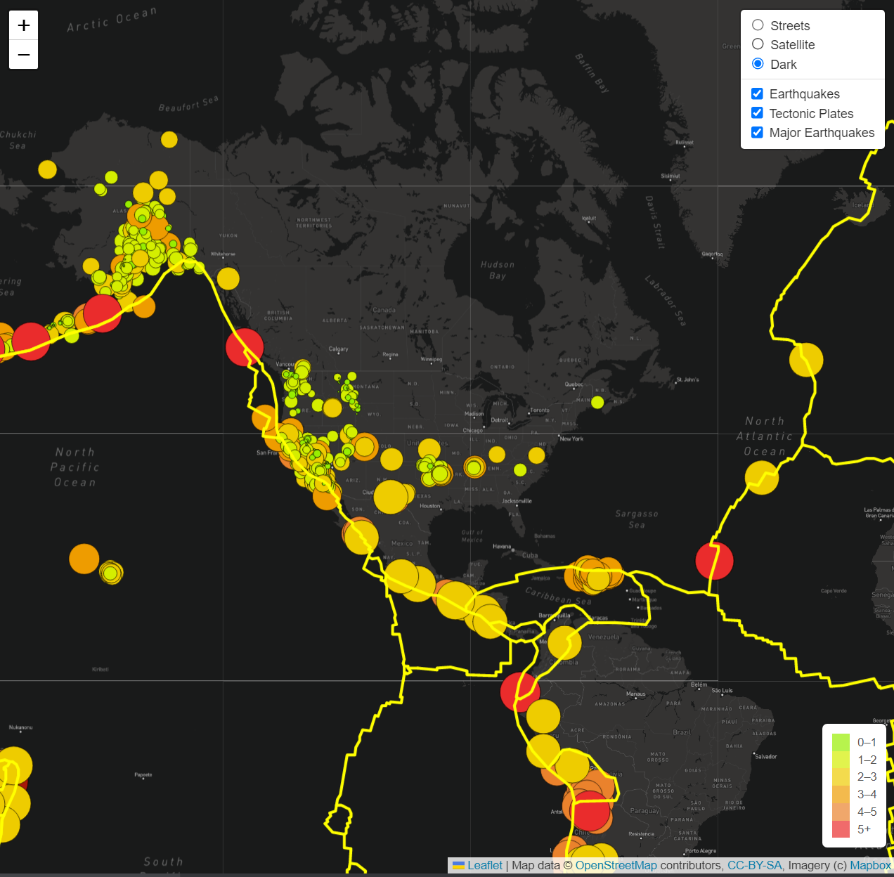

# Mapping Earthquakes with Javascript & APIs

    

## 
Use Javascript to visualize differences in global earthquake magnitude in the previous week

<a href="#goals">Goals</a> &nbsp;&bull;&nbsp;
<a href="#dataset">Dataset</a> &nbsp;&bull;&nbsp;
<a href="#tools-used">Tools Used</a> &nbsp;&bull;&nbsp;
<a href="#results">Results</a>

# 
Goals

The client wantS an earthquake map with two different maps and the earthquake overlay. I'll build that interactive map with Javascript and utilize D3.js to perform API calls. This API allows me to add Earthquake data in relation to the tectonic plates’ location on the earth - prioritizing earthquakes with a magnitude greater than 4.5 on the map. I will use a URL for GeoJSON earthquake data from the USGS website and retrieve geographical coordinates and the magnitudes of earthquakes for the last seven days, then add the data to a map. Finally, I will use JavaScript and the D3.js library to retrieve the coordinates and magnitudes of the earthquakes from the GeoJSON data. Then I will use the Leaflet library to plot the data on a Mapbox map through an API request and create interactivity for the earthquake data.

# 
Dataset

Using GeoJSON data, which is a type of JavaScript Object Notation (JSON) data that is specifically designed to host geographical information.

- **GeoJSON Data:** type of JavaScript Object Notation (JSON) data that is specifically designed to host geographical information, retrieved via API from earthquake.usgs.gov.

# 
Tools Used

- **Javascript:** Programming language used for creating visually appealing and dynamic web content
    - **Plotly.js:** Javascript library used to create engaging and dynamic charts
    - **D3.js:** Javascript library used for data visualization, reading JSON files and placing API calls
    - **GeoJSON:** JavaScript Object Notation (JSON) data that is specifically designed to host geographical information
    - **Leaflet.js:** Open source JavaScript library used to build web mapping applications
- **HTML:** Hypertext Markup Language used to build and design webpages
- **CSS:** Creative Style Sheets add dynamic visual styling to html webpages

# 
Results

Using JavaScript, Leaflet.js, and geoJSON data, I added tectonic plate data using d3.json(), add the data using the geoJSON() layer, set the tectonic plate LineString data to stand out on the map, and added the tectonic plate data to the overlay object with the earthquake data.

I then used the same methods to add major earthquake data to the map using d3.json(). I also added color and set the radius of the circle markers based on the magnitude of earthquake, and added a popup marker for each earthquake that displays the magnitude and location of the earthquake using the GeoJSON layer, geoJSON().

[Back to top](#mapping-earthquakes-with-javascript-&-apis)
